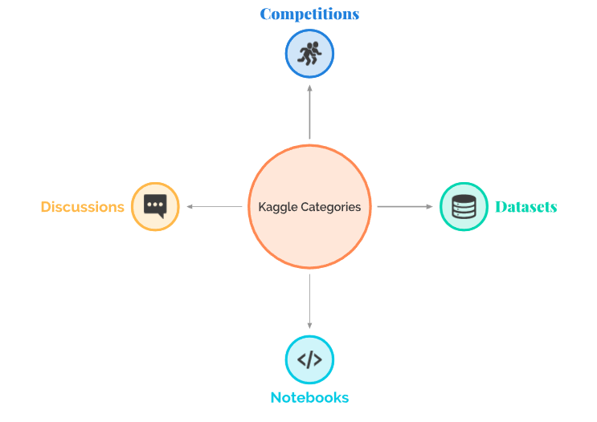

  
  
# What I learnt by interviewing numerous Kaggle Grandmasters1

Over the past year, I have had the opportunity to interview some of the finest Kaggle Grandmasters. Not only have I learnt about their journey to the top, but I also gained first-hand knowledge about their journey and their dedication towards their craft. The list below is a consolidation of all the interviews that I have conducted so far. Some of these interviews are old(for instance, Bojan and Rohan are now Grandmasters in all four categories), and I intend to update them to reflect the latest rankings and status. However, what doesn't change is their golden advice and experience in tackling some of the most challenging problems in data science.

## Kaggle

[Kaggle](www.kaggle.com) is an online community of data scientists and machine learning practitioners. One can participate in various data science competitions, share code and datasets, and indulge in Data Science related discussions.

## Kaggle Progression System
Kaggle tracks users performance by awarding medals in the four different categories:

Based on your number of medals you earn you could be one or more of the following:

 `Novice` 
 `Contributor`
 `Expert`
 `Master`
 `Grandmaster`

 
  

| Name | Profile Pic| Link to Kaggle Profile | Number of times in Top 52 | Golden Advice | Written Interview |
|------| ---------- | ---------------------- | :-----------------------: | ------------- |-------------------| 
| Dmitry Gordeev |  |  |  7 | “The common approaches and state-of-the-art models usually suffice to achieve impressive results. But if you want to do better, you have to think outside the box. And it is a field with endless opportunities to be creative.”|  |
| Guanshuo Xu | | | 8 |"As far as new developments in machine learning are concerned, it depends on the actual needs. I tend to filter out anything not instantly helpful and maybe keep an eye on the potentially exciting stuff. Then I get back to it as and when needed." |  |
| Philipp Singer |  |  | 12 |"A lot of success on Kaggle is based on experience and the willingness to touch and learn about things that at first glance, you do not know much about." | |
| Gábor Fodor | | | 6 |"Don’t be afraid to start and prepare for the long run. The community is enormous and willing to share. If you already learned the basics and want to get your hands dirty, I can only recommend participating in Kaggle competitions." | |
| Fatih Öztürk | | | 1 |"I would suggest not worry too much about questions like — where to start, which courses to take, which tools to learn etc. Instead of dealing with all these questions initially, it is advisable to directly jump into a data science project or a competition and learn from others’ code. This is the way I improved myself by getting my hands dirty early on." | |
| Sudalai Rajkumar | | | 2 |"First and foremost, data science enthusiasts must understand whether this field is of actual interest to them or they want to get associated with it just because of the hype around it. It is a rapidly evolving field and requires continuous learning, and so only passion will help sustain in the long run." | |
| Yauhen Babakhin | | | 4 |"Just reading the books, blog posts, skimming through online courses will not give you any hands-on experience. You will only obtain some theoretical understanding that you won’t be able to apply in practice. On the other hand, going right away to the application would also become a monkey job. Running simple `fit()predict()` and blindly copying public Kaggle kernels, without any understanding of what’s going on under the hood, would also lead you nowhere." | |
| Shivam Bansal | | | 3 |"Think from an end to end perspective. This means that it is necessary to keep a business perspective in mind while developing a data science solution. This thinking helps in coming up with a creative and relevant solution for any business problem at hand." |  |
| Bojan Tunguz | | | 3 |"Familiarize yourself with all those resources. Come up with a reasonable plan that works for you. It’s essential to build your technical skills but invest time to work on your “soft” skills as well: writing, communication, networking, etc. Be patient with yourself and allow yourself time to grow and develop. Don’t be afraid to fail. Make the point to learn from your failures. And, most importantly, try to have fun and enjoy your journey in its own right as much as possible." |  |
| Rohan Rao |  |  | 2 |"My advice to others would be to identify an area that suits their skill-sets and then work towards solving a problem in that direction. It is essential to be hands-on in any DS work because it is only then one can understand all the nitty-gritty of the profile. Working on DS projects as part of a company/team as a full-time contributor is also preferable because it gives exposure to the entire workflow of a DS project" | |

## [Other Articles](https://github.com/parulnith/Data-Science-Articles#readme)
A collection of my blogs on Data Science and Machine learning.These are hosted on [Medium](https://medium.com/@pandeyparul) as well as my [Website](https://parulpandey.com/).

## [Subscribe to my Newsletter](https://parulpandey.substack.com/archive)

1. This list will be updated as soon as I publish a new interview.
  
2. Subject to change

